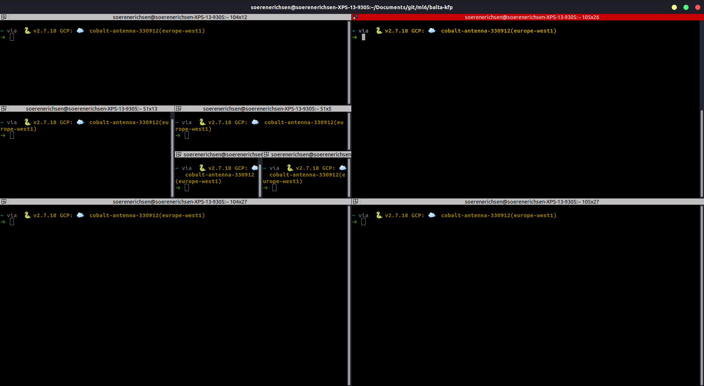
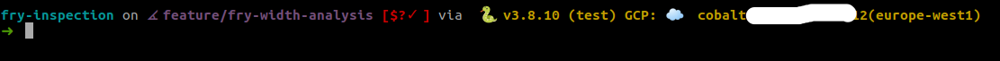

## Terminator
Terminator is a Linux Terminal Emulator which provides you with functionalities like splitting your terminal. 
My favourite setting is to open 4 terminals in one window by default.

Most used keyboard shortcuts are:

| Shortcut | Description|
|:----: |:----:|
| ctrl+shift+x| Focus current terminal|
| ctrl+shift+n | Switch between terminals |
| ctrl+shift+o | Split horizontally |
| ctrl+shift+e | Split vertically |
| ctrl+shift+w | Close current terminal |


You should be able to install it by running `sudo apt-get install terminator` (On Linux).

# fzf
One of the most important Plugins I use every day. 
After you installed it, you can search your command history by using ctrl+r. 
It helps you find commands, you have used a long time ago, but you still remember parts of the command.

[HOW TO INSTALL](https://github.com/junegunn/fzf#installation)

Add `[ -f ~/.fzf.zsh ] && source ~/.fzf.zsh` to your `.zshrc` or the equivalent to your `.bashrc` in order to source it on terminal start.

# Starship
The minimal, blazing-fast, and infinitely customizable prompt for any shell!

[WEBSITE](https://starship.rs/)

Here is an example of my current prompt:

I have configured it in a way that it shows the git status, the python version, the currently activated virtual environment
the currently logged in gcp project and its region. 

# Some helpful aliases and commands
Some aliases, that I added to my .zshar/.bashrc.
```
alias ll='ls -alF'
alias la='ls -A'
alias l='ls -CF'
```

The following alias triggers a "ls" command when ever I enter a new directory. 
Therefore, I know the contained folder and file names already after moving into a new dir without using ls all the time. 
```
chpwd() { ls }
```

This alias provides me detailed information about the size of files and folders, sorted by size.
```
alias du='du -sh * | sort -hr'
```
Use `cat file.txt` to print out the content of a file
```
cat file.txt
```


# Shell operators
```
command1 & command2
```
Use `&` to execute a command in the background. In this case command1 will be launched in the background and command2 in the foreground, without waiting for command1 to finish. 

```
command1 && command2
```
Use `&&` to chain commands so that they are executed one after another.
However, command2 will only be executed if command 1 succeeds.

```
command1 | command2
```
Use the output of command 1 as the input of command 2. This is called a pipeline
If you use `|&` it will send std out and std error to the next command. 

```
command1 > output.txt
```
Redirect and write the output of a command into a textfile. Point the arrow the other way around if you want to use the content of a file as input to command.

```
command >| out.txt
```
This will overwrite the content of out.txt.

```
command >> out.txt
```
This will append the content to out.txt, if the file already exists.
